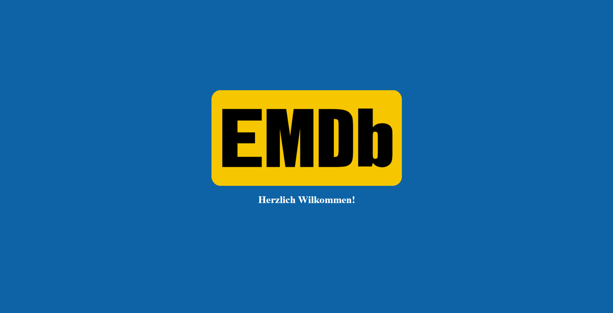
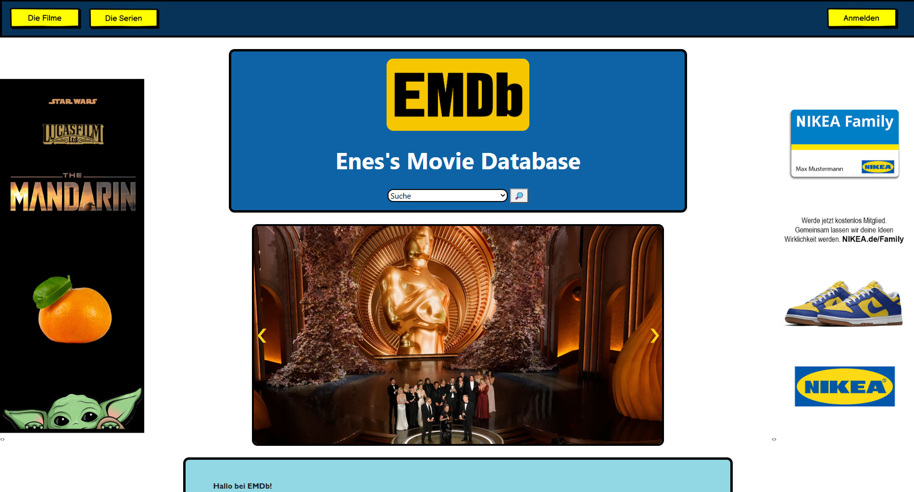
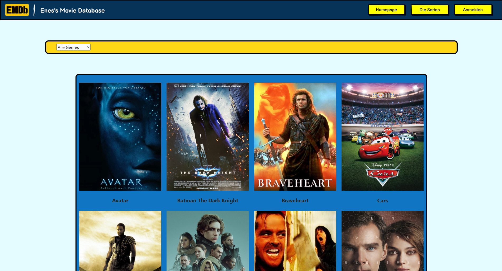

<div align="center">

# EMDb

*Enes's Movie Database* — browse, search, and discover movies and TV series in one place.

[](https://ef-krbg.github.io/EMDb/)
[](https://github.com/ef-krbg/EMDb/archive/refs/heads/main.zip)

</div>

---

## About

EMDb is a movie and TV series catalog site. It lets you search titles from the homepage, browse movies and series by genre, and check entertainment news, all in a Bootstrap-styled interface with account signup/login.

## Screenshots

<p align="center">
  
  
  
</p>

## Features

- **Movie & series catalog** — Browse a catalog of movies and series, filterable by genre (Abenteuer, Action, Animation, Fantasy, Science-Fiction, Thriller).
- **Quick search** — a dropdown search on the homepage jumps straight to any movie or series by title.
- **Title details** — each entry includes its genre, director, cast, and an EMDb rating.
- **Entertainment news carousel** — rotating movie and industry news headlines on the homepage.
- **Account signup/login** — a dedicated registration and login page.

---

## Getting Started

Click **Use it Online** above to open the site straight in your browser — nothing to install.

Click **Download** to get a `.zip` of the site. Unzip it and open `index.html` in your browser to run it offline.


## Project Structure

```
EMDb/
├── index.html              # Welcome screen
├── home.html                # Homepage: search, news carousel, about
├── assets/
│   ├── html/                 # diefilme.html (movies), dieserie.html (series), anmeldung.html (login/register)
│   ├── js/                    # Movie & series data and page logic
│   ├── pic/                    # Posters (Films/, Serie/), banners (werbung/), logo & nav icons
│   └── style/
│       └── style.css
├── LICENSE
└── README.md
```

## Tech Stack

HTML · CSS · JavaScript · [Bootstrap](https://getbootstrap.com/) · jQuery · [Owl Carousel](https://owlcarousel2.github.io/OwlCarousel2/)

## License

Distributed under the MIT License. See `LICENSE` for details.

---

<div align="center">

Enes Fatih Karabag — [github.com/ef-krbg](https://github.com/ef-krbg)

</div>
